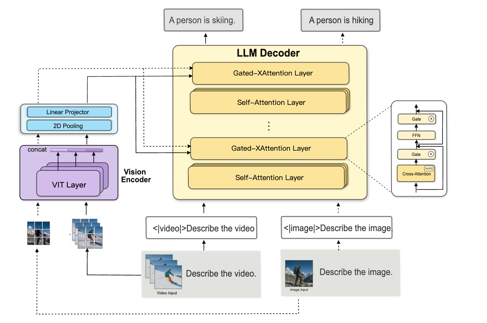
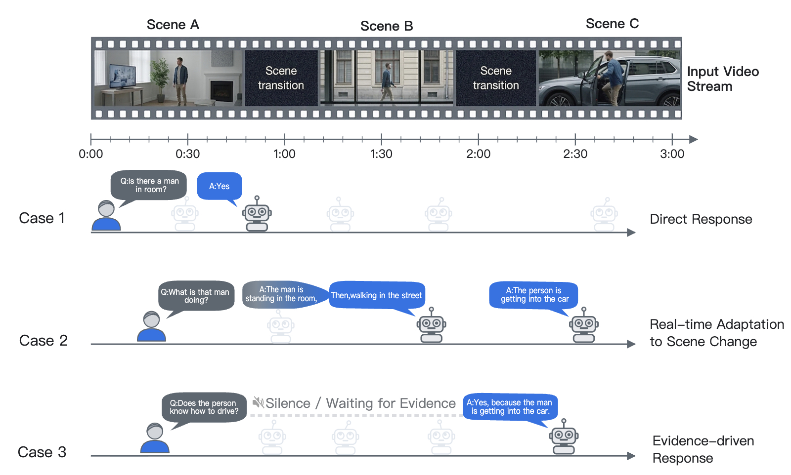

<p align="center">
    
</p>

<div align="center">
    <a href="https://github.com/OpenMOSS/MOSS-Video-Preview"></a>
    <a href="https://huggingface.co/collections/OpenMOSS-Team/moss-video-preview"></a>
    <a href="https://modelscope.cn/collections/openmoss/MOSS-Video-Preview"></a>
</div>

<div align="center">
    <a href="#"></a>
    <a href="#"></a>
    <a href="#"></a>
    <a href="./LICENSE"></a>
</div>

<p align="center">
    <a href="./README.md"><b>English</b></a> | <a href="./README_ZH.md"><b>中文</b></a>
</p>


## MOSS-Video-Preview: Next-Generation Real-Time Video Understanding
MOSS-Video-Preview is a multimodal vision foundation model specifically engineered for real-time video understanding. Built upon the Llama-3.2-Vision architecture, we have comprehensively extended the model's native video processing capabilities, empowering it with state-of-the-art real-time multimodal reasoning performance.

> [!IMPORTANT]
> 💡 **Project Note**: 
> 
> At this stage, this project serves as an **exploratory endeavor**, leveraging high-quality open-source datasets to validate the potential of the Cross-Attention architecture for native real-time video understanding. This is only the beginning; we have committed to a comprehensive **scaling roadmap** across three dimensions: **Data Scaling**, **Parameter Scaling**, and **Context Scaling**, with the goal of building more robust and general-purpose video intelligence.
>
> As we strive to build more robust and general-purpose video intelligence, we warmly welcome experts in Representation Learning, Model Compression and Inference Acceleration to join our journey. Whether you are optimizing inference latency or exploring efficient architecture, we invite you to experiment and innovate on top of our framework. Let's push the boundaries of video intelligence and advance the open-source community together!


### 🌟 Key Highlights

*   **🧩 Image-Video Cross-Attention Architecture**: 
    By transcending the limitations of conventional architectures, **MOSS-Video-Preview** leverages a native Cross-Attention mechanism to provide unified image-video understanding. This approach enables deep decoupling of visual and linguistic features, facilitating seamless and continuous analysis of ultra-long temporal sequences.

*   **🔄 Millisecond-Level Interaction & Dynamic Self-Correction**: 
    The system supports seamless transitions between "Silence" and "Speak" modes. With enhanced contextual awareness, the model allows for real-time interruptions to adjust or refine responses dynamically as video scenes evolve, delivering a truly responsive, full-duplex user experience.


*   **⚡ Extreme Inference Performance & Kernel Optimization**: 
    By leveraging deeply optimized Cross-Attention kernels and Flash Attention 2 acceleration on both CUDA and NPU platforms, MOSS-Video-Preview is specifically engineered for long-form video processing. It achieves ultra-low latency while significantly reducing memory overhead.

*   **📊 Fine-grained Data Synthesis Pipeline**:
    We have engineered a sophisticated data synthesis pipeline for real-time video understanding, powered by state-of-the-art multimodal LLMs. We are committed to open-sourcing these datasets in the near future to support the research community and collectively advance the frontier of real-time video perception.


## 📌 Table of Contents
- [🔥 News](#-news)
- [🏗️ Model Architecture](#️-model-architecture)
- [🌊 Real-Time Inference Process](#-real-time-inference-process)
- [🎬 Demo](#-demo)
- [📊 Training Stages & Data Composition](#-training-stages--data-composition)
- [📊 Evaluation Results](#-evaluation-results)
- [📈 Streaming Inference Speed (Single-Setup Measurement)](#-streaming-inference-speed-single-setup-measurement)
- [🚀 Quick Start](#-quick-start)
- [🛠️ Training & Fine-tuning](#️-training--fine-tuning)
- [📥 Model Download](#-model-download)
- [💡 Limitations & Future Outlook](#-limitations--future-outlook)
- [📑 TODO List](#-todo-list)
- [Citation](#citation)
- [Acknowledgement](#acknowledgement)

## 🔥 News
- **2026/04/08**: 🎉 [MOSS-VL](https://github.com/OpenMOSS/MOSS-VL) is officially open-sourced! Released MOSS-VL-Base-0408 and MOSS-VL-Instruct-0408. 
- **2026/03/04**: 🚀 MOSS-Video-Preview source code and architecture details released!
- **2025/10/18**: 🧭 Post-mortem on current issues; started MOSS-VL project.
- **2025/10/08**: 🎬 Internal demo showcased within the lab and the school.
- **2025/09**: 🌟 moss-video-preview-realtime-sft ready.
- **2025/08**: ✅ moss-video-preview-sft ready.


## 🏗️ Model Architecture
Built on a **native Real-Time temporal architecture**, MOSS-Video-Preview **decouples** visual perception and linguistic reasoning to minimize computational latency. This enables **millisecond-level** streaming performance, ensuring a highly responsive and fluid interactive experience for continuous video streams.

<p align="center">
    
    <br>
    <em>Figure 1: Overall architecture of MOSS-Video-Preview.</em>
</p>

## 🌊 Real-Time Inference Process

The core strength of MOSS-Video-Preview lies in its **native real-time streaming** capability, enabling continuous, low-latency processing of live video feeds.

<p align="center">
    
    <br>
    <em>Figure 2: Real-Time inference pipeline.</em>
</p>

#### ⚙️ Inference Mechanism

*   **Asynchronous Real-Time Input**
    Video frames are continuously injected at a stable frame rate for high-frequency real-time perception. The input process is **non-blocking** and fully decoupled from the text generation loop, ensuring uninterrupted visual tracking.
*   **Long-range State Persistence**
    Leveraging **Cross-Attention KV Cache** and **Temporal Positional Encoding**, the model maintains robust contextual dependencies across continuous frames, ensuring coherent temporal understanding over extended sequences.
*   **Ultra-Low Latency Streaming Response**
    The model supports simultaneous autoregressive generation alongside the incoming video stream. By eliminating the need for full-clip buffering, it achieves "on-the-fly" reasoning and interaction with minimal end-to-end latency.

#### 🧩 Core Components

*   **Cross-Modal Projector**
    Featuring the proprietary `VideoMllamaTextCrossAttention` mechanism, this component utilizes bidirectional cross-attention to achieve highly efficient fusion and semantic alignment between temporal visual features and linguistic context.
*   **Streaming Causal Decoding Module**
    A specialized decoder for autoregressive generation based on dynamic visual inputs. It possesses **dynamic adaptability**, allowing it to real-time adjust and refine generated content based on the latest visual cues captured from the stream.


## 🎬 Demo
### Real-Time Video
<div align="center">
  <video src="https://gist.github.com/user-attachments/assets/7a9247fe-4521-48f9-90e0-0da88d20295c" width="70%" poster="" controls></video>
</div>

### Offline Video
<div align="center">
  <video src="https://gist.github.com/user-attachments/assets/715c16bd-01e5-4b30-94be-ef5654a732aa" width="70%" poster="" controls></video>
</div>

### Offline Image Demo Video
<div align="center">
  <video src="https://gist.github.com/user-attachments/assets/39de90cf-4857-492b-8146-e901cee522d1" width="70%" poster="" controls></video>
</div>


## 📊 Training Stages & Data Composition
MOSS-Video-Preview employs a **three-stage progressive training strategy** to evolve the model from basic modality alignment to complex real-time video reasoning.

| Stage | Core Objective | Trainable Parameters | Data Mixture (T / I / V) | Training Samples |
| :--- | :--- | :--- | :--- | :--- |
| **PT-Stage 1** | Cross-modal Alignment | **Vision Projector only** | 0% / 79% / 21% | 15.1 M |
| **PT-Stage 2** | Temporal & Long Video Perception | **Full Parameters** | 0% / 26% / 74% | 1.8 M |
| **Offline SFT** | Instruction Following & Reasoning | **Full Parameters** | 14% / 44% / 42% | 8.6 M |
| **Real-Time SFT** | Real-Time understanding and reasoning | **Full Parameters** | 11% / 29% / 60% | 836 K |


## 📊 Evaluation Results

| Category | Benchmark | **Our Model** | Llama 3.2 (Base) | Qwen 2.5-VL (32B) | Qwen 2.5-VL (7B) | LLaVA-OV (7B) |
| :--- | :--- | :---: | :---: | :---: | :---: | :---: |
| **Video Logic** | **Video-Holmes** | **39.9** 🚀 | - | 38.4 | 33.0 | 33.0 |
| **Video General** | **VideoMME** | **62.4** | 46.0 | 70.5 | 65.1 | 58.2 |
| **Spatial Reasoning** | **VSI-Bench** | **31.7** | 20.6 | - | 34.2 | - |
| **Long Video** | **LongVideoBench** | **54.2** | 45.5 | - | 56.0 | 56.3 |
| **Video MCQ** | **MVBench** | **55.8** | - | - | 62.8 | 56.7 |
| **Image Core** | **MMMU (Val)** | **48.6** | 48.0 | 70.0 | 58.6 | 48.8 |
| **Image Core** | **MMBench (EN)** | **77.3** | 72.8 | - | 82.6 | 80.8 |
| **Image OCR** | **OCRBench** | **714** | - | - | 845 | - |
| **Real-world** | **RealWorldQA** | **63.1** | - | - | 68.4 | 66.3 |

MOSS-Video-Preview demonstrates exceptional performance across various video and image benchmarks, particularly excelling in complex temporal reasoning and streaming scenarios:
- **Superior Video Logic**: Our model achieves **39.9** on **Video-Holmes**, significantly outperforming Qwen 2.5-VL (32B) and other 7B-class models, highlighting its advanced logical reasoning capabilities.
- **Robust Video Perception**: Scores **62.4** on **VideoMME** and **54.2** on **LongVideoBench**, proving its effectiveness in handling both general and long-duration temporal dependencies.
- **Balanced Multimodal Foundation**: While optimized for video, it maintains strong image understanding (e.g., **77.3** on **MMBench EN**), ensuring a versatile foundation for diverse tasks.

The core optimization of MOSS-Video-Preview lies in bridging the gap between high-quality reasoning and low-latency real-time streaming, as further evidenced by the speed measurement below.

## 📈 Streaming Inference Speed (Single-Setup Measurement)

We measure streaming inference speed of MOSS-Video-Preview against another strong open-source video model under the **same hardware and decoding configuration** (this is a single-setup speed comparison, not a standardized benchmark suite).

- **Hardware**: NVIDIA H200 (single GPU)
- **Video sampling**: 256 extracted frames  
- **Input video**:
  - Path: `data/example_video.mp4`
  - Resolution: 1920×1080
  - Duration: 97.56 s
  - Bitrate: 2223.33 kbps (approx)

**Speed comparison (higher TPS and lower latency are better):**

| Model                | Frames | Parameters | Avg TTFT (s) | Avg TPS (tokens/s) | Avg Total Latency (s) | P95 TTFT (s) |
|----------------------|--------|------------|--------------|--------------------|------------------------|--------------|
| **MOSS-Video-Preview** | 256    | 11B        | **1.9537**   | **38.41**          | **28.5104**            | **1.9573**   |
| Qwen2.5-VL-7B        | 256    | 7B         | 9.9402       | 14.26              | 52.7624                | 9.9564       |

Under this setting, MOSS-Video-Preview delivers **~5× faster TTFT**, **~2.7× higher decoding throughput (TPS)**, and **significantly lower end-to-end latency** compared with Qwen2.5-VL-7B, making it highly suitable for Real-Time Video Understanding. It remains strongly competitive even with a larger parameter count, indicating substantial headroom for further speedup in larger-scale settings.

## 🚀 Quick Start

### Environment Setup
```bash
conda create -n moss-video python=3.12.4 -y
conda activate moss-video
pip install -e .
```

### Example Data
This repository includes a small set of example files:
- Video: `data/example_video.mp4`
- Image: `data/example_image.jpg`

### Optional: Install PyTorch and FlashAttention2 (recommended for CUDA GPUs)
Tested setup: **Python 3.12.4 + PyTorch 2.4.0 (CUDA 12.1) + DeepSpeed 0.16.1**.

First, install PyTorch (select the appropriate build for your CUDA/CPU environment), then install FlashAttention2 and DeepSpeed:

```bash
# CUDA 12.1 (recommended)
pip install --index-url https://download.pytorch.org/whl/cu121 "torch==2.4.0"

# CPU-only (if CUDA is unavailable)
# pip install --index-url https://download.pytorch.org/whl/cpu "torch==2.4.0"

pip install -e ".[flash-attn,deepspeed]" --no-build-isolation
```

### Run Inference
MOSS-Video-Preview supports offline, and streaming inference modes.

#### 1. Offline Inference (Base/SFT checkpoints)
Offline inference processes the entire video at once. This is suitable for batch processing or analyzing pre-recorded videos.

```bash
# Run offline inference demo
python -m inference.offline_infer \
  --checkpoint models/moss-video-sft \
  --video_path data/example_video.mp4 \
  --prompt "Describe the video." \
  --max_new_tokens 512
```

#### 2. Real-Time SFT Offline Inference (Real-Time SFT checkpoints only)
This mode runs offline (non-streaming) generation but **must** use a Real-Time SFT checkpoint (the same type as used for streaming inference). It is **not** compatible with base or plain SFT checkpoints.

```bash
# Run Real-Time SFT offline inference demo
python -m inference.realtime_offline_infer \
  --checkpoint models/moss-video-realtime-sft \
  --video_path data/example_video.mp4 \
  --prompt "Describe the video." \
  --max_new_tokens 512
```

#### 3. Streaming Inference (Real-Time SFT checkpoints only)
Streaming inference processes video frames in real-time as they are received. This is ideal for live streams or low-latency applications.

```bash
# Run streaming inference demo
python -m inference.realtime_streaming_infer \
  --checkpoint models/moss-video-realtime-sft \
  --video_path data/example_video.mp4 \
  --prompt "Describe the video." \
  --max_new_tokens 512
```

The streaming inference uses a unified pipeline where frames are fed into an `image_queue` and tokens are consumed from a `token_queue` in real-time.


## 🛠️ Training & Fine-tuning
MOSS-Video-Preview supports a variety of training modes via LlamaFactory integration.

| Mode | VRAM (GB/GPU) | Hardware | Config File |
|------|---------------|----------|-------------|
| PT (Pretrain) | ≈80GB | H100/H200 | `mllm_pretrain_1node.yaml` |
| SFT (Offline) | ≈80GB | H100/H200 | `mllm_offline_sft_1node.yaml` |
| SFT (Real-time) | ≈80GB | H100/H200 | `mllm_realtime_sft_1node.yaml` |

To start training, use the following command:
```bash
FORCE_TORCHRUN=1 llamafactory-cli train train_config/mllm_pretrain_1node.yaml
```

You can choose different configuration files from the `train_config` directory based on the training stage:
- **pretrain**: `train_config/mllm_pretrain_1node.yaml`
- **sft-offline**: `train_config/mllm_offline_sft_1node.yaml`
- **sft-realtime**: `train_config/mllm_realtime_sft_1node.yaml`

## 📥 Model Download 

| Model | 🤗Download Link | 🤖ModelScope Link |
| :--- | :--- | :--- |
| **moss-video-preview-base** | [HuggingFace](https://huggingface.co/OpenMOSS-Team/moss-video-preview-base) | [ModelScope](https://modelscope.cn/models/openmoss/moss-video-preview-base) |
| **moss-video-preview-sft** | [HuggingFace](https://huggingface.co/OpenMOSS-Team/moss-video-preview-sft) | [ModelScope](https://modelscope.cn/models/openmoss/moss-video-preview-sft) |
| **moss-video-preview-realtime-sft** | [HuggingFace](https://huggingface.co/OpenMOSS-Team/moss-video-preview-realtime-sft) | [ModelScope](https://modelscope.cn/models/openmoss/moss-video-preview-realtime-sft) |

### 🚀 Limitations & Future Outlook

*   **Performance Benchmarking**: While the real-time comprehension capability has been successfully validated, a performance gap remains compared to top-tier semi-open-source models such as **Qwen2.5-VL**. Closing this gap and aligning with SOTA benchmarks is a primary focus for our future iterations.
*   **Scalable Distributed Training**: The current training pipeline is primarily optimized for architectural validation. We plan to integrate the **Megatron-LM framework** to leverage advanced **3D parallelism (Tensor, Pipeline, and Data Parallelism)** for large-scale pre-training and fine-tuning. In the next major release, we will officially open-source the complete training codebase, model weights, and configurations.
*   **Data Scaling & Diversity**: Our current training relies heavily on public datasets. Future updates will focus on expanding the scale and diversity of our multimodal data to enhance the model's generalizability and overall robustness across a wider range of real-world scenarios.

## 📑 TODO List
- [x] Unified Position Encoding
- [x] NPU/CUDA Flash Attention 2 Integration
- [x] Streaming Vision Encoder
- [x] LlamaFactory Training Support
- [ ] Technical Report
- [ ] Open-source Moss-VL

## Citation
```bibtex
@misc{moss_video_2026,
  title         = {{MOSS-Video-Preview: Next-Generation Real-Time Video Understanding}},
  author        = {OpenMOSS Team},
  year          = {2026},
  howpublished  = {\url{https://github.com/OpenMOSS/MOSS-Video-Preview}},
  note          = {GitHub repository}
}
```

## Contributor Roles
- **Core Contributor**: Pengyu Wang\*, Chenkun Tan, Shaojun Zhou, Wei Huang, Qirui Zhou, Zhan Huang, Zhen Ye, Jijun Cheng
- **Contributor**: Xiaomeng Qian, Yanxin Chen, Xingyang He, Huazheng Zeng, Chenghao Wang, Hongkai Wang, Pengfei Wang, Chenghao Liu, Shanqing Gao, Yixian Tian, Xinghao Wang, Botian Jiang, Xipeng Qiu†

> **Legend**: \* Project Leader; † Corresponding Author


## Acknowledgement
We extend our gratitude to the contributors of [LlamaFactory](https://github.com/hiyouga/LLaMA-Factory), [Transformers](https://github.com/huggingface/transformers), and the OpenMOSS community for their invaluable support.

## Star History

<a href="https://www.star-history.com/?repos=OpenMOSS%2FMOSS-Video-Preview&type=date&legend=top-left">
 <picture>
   <source media="(prefers-color-scheme: dark)" srcset="https://api.star-history.com/chart?repos=OpenMOSS/MOSS-Video-Preview&type=date&theme=dark&legend=top-left" />
   <source media="(prefers-color-scheme: light)" srcset="https://api.star-history.com/chart?repos=OpenMOSS/MOSS-Video-Preview&type=date&legend=top-left" />
   
 </picture>
</a>
