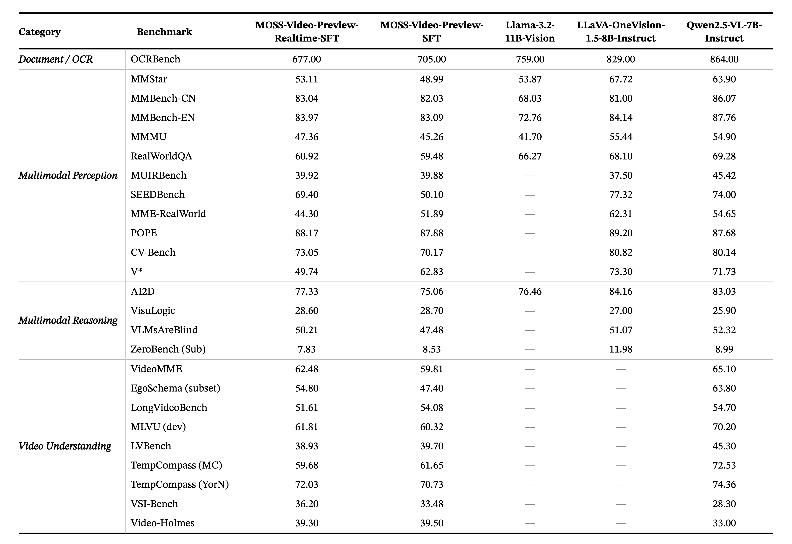

<p align="center">
    
</p>

<div align="center">
    <a href="https://github.com/OpenMOSS/MOSS-Video-Preview"></a>
    <a href="https://huggingface.co/collections/OpenMOSS-Team/moss-video-preview"></a>
    <a href="https://modelscope.cn/collections/openmoss/MOSS-Video-Preview"></a>
</div>

<div align="center">
    <a href="#"></a>
    <a href="#"></a>
    <a href="#"></a>
    <a href="https://github.com/OpenMOSS/MOSS-VL/blob/main/assets/wechat.jpg"></a>

    <a href="./LICENSE"></a>
</div>

<p align="center">
    <a href="./README.md"><b>English</b></a> | <a href="./README_ZH.md"><b>中文</b></a>
</p>


## MOSS-Video-Preview: 下一代实时视频理解

MOSS-Video-Preview 是一款专为实时视频理解打造的多模态视觉基础模型。基于 Llama-3.2-Vision 架构，我们全面提升了模型原生处理视频的能力，使其具备了卓越的实时多模态推理表现。

> [!IMPORTANT]
> 
> 💡 <strong>项目说明</strong>：
>
> 本项目目前处于<strong>探索性阶段</strong>，旨在利用高质量开源数据集，验证 Cross-Attention 架构在原生实时视频理解任务中的潜力。这仅仅是一个起点，我们已制定了覆盖<strong>数据规模（Data Scaling）</strong>、<strong>参数规模（Parameter Scaling）</strong>和<strong>上下文长度（Context Scaling）</strong>三个维度的完整演进路线图，致力于打造更稳健、更通用的视频智能模型。
>
> 我们诚挚邀请在<strong>表征学习（Representation Learning）</strong>、<strong>模型压缩（Model Compression）</strong>及<strong>推理加速（Inference Acceleration）</strong>领域有深厚积累的开发者加入我们。无论您是致力于优化推理延迟，还是希望探索高效的架构设计，我们都欢迎您基于本框架进行实验与创新。让我们共同突破视频智能的边界，推动开源社区的进步！


🌟 核心亮点

- 🧩 **图像-视频 Cross-Attention 架构**：
  打破现有主流架构局限，MOSS-Video-Preview 原生支持图视统一理解。通过 Cross-Attention 机制实现视觉与语言的深度解耦，支持超长时序内容的连续、流畅解析。

- 🔄 **毫秒级实时交互与动态自纠错**：
  系统支持在“静默”与“发言”模式之间无缝切换。凭借强大的上下文感知能力，模型允许用户在视频场景演变时进行实时打断，从而动态调整或修正反馈，提供真正具备响应式、全双工特性的交互体验。


- ⚡ **极致推理性能与算子加速**：
  通过针对 CUDA 和 NPU 平台深度优化 Cross-Attention 算子并集成 Flash Attention 2 加速，MOSS-Video-Preview 专为长视频流处理而生。在显著降低显存开销的同时，实现了极低的推理延迟。

- 📊 **精细化数据合成流水线**：
  我们构建了一套基于SOTA视觉理解模型驱动的精细化视频理解数据合成流水线。我们承诺在不久的将来开源这些数据集，旨在服务研究社区，并共同推动实时视频感知技术的前沿发展。
  


## 📌 目录
- [🔥 新闻](#-新闻)
- [🏗️ 模型架构](#️-模型架构)
- [🌊 实时推理流程](#-实时推理流程)
- [🎬 演示 (Demo)](#-演示-demo)
- [📊 训练阶段与数据组成](#-训练阶段与数据组成)
- [📊 评测结果](#-评测结果)
- [📈 流式推理解码速度](#-流式推理解码速度)
- [🚀 快速开始](#-快速开始)
- [🛠️ 训练与微调](#️-训练与微调)
- [📥 模型下载](#-模型下载)
- [💡 局限和展望](#-局限和展望)
- [📑 待办事项 (TODO)](#-待办事项-todo)
- [引用](#引用)
- [致谢](#致谢)

## 🔥 新闻
- **2026/04/08**: 🎉 [MOSS-VL](https://github.com/OpenMOSS/MOSS-VL) 正式开源！发布了 MOSS-VL-Base-0408 和 MOSS-VL-Instruct-0408。
- **2026/03/04**: 🚀 MOSS-Video-Preview 源代码和架构细节发布！
- **2025/10/18**: 🧭 对当前问题进行复盘，并启动 MOSS-VL 项目。
- **2025/10/08**: 🎬 在实验室与学院内部完成 Demo 展示。
- **2025/09**: 🌟 moss-video-preview-realtime-sft 训练完成。
- **2025/08**: ✅ moss-video-preview-sft 训练完成。

 
## 🏗️ 模型架构
MOSS-Video-Preview 基于 **原生实时时序架构** 构建，通过将视觉感知与语言推理**解耦**，极大降低了计算延迟。这使得模型能够实现**毫秒级的流式处理性能**，为连续视频流提供极高响应速度和流畅的交互体验。

<p align="center">
    
    <br>
    <em>图 1: MOSS-Video-Preview 总体架构。</em>
</p>

## 🌊 实时推理流程
MOSS-Video-Preview 的核心优势在于其原生的实时处理架构，能够以极低延迟、连续地解析动态视频流，实现真正意义上的实时视频理解。

<p align="center">
    
    <br>
    <em>图 2: 实时推理流程。</em>
</p>

#### ⚙️ 推理机制 (Inference Mechanism)

*   **异步逐帧 实时输入**
    视频帧以稳定频率持续注入模型，实现高频实时视觉感知。输入链路与文本输出链路完全**解耦（Decoupled）**，确保视觉捕捉的连续性不受生成逻辑的中断或阻塞。
*   **长程状态保持**
    依托 **Cross-Attention KV Cache** 与**时序位置编码 (Temporal Positional Encoding)**，模型能够在连续视频流中维持稳健的长程上下文关联，实现跨帧的信息沉淀与时序对齐。
*   **实时响应**
    支持在视频流推进的同时同步进行自回归文本生成。无需等待完整片段缓存，显著降低端到端延迟，实现“边看边说”的极致交互体验。

#### 🧩 核心组件 (Core Components)

*   **跨模态投影器 (Cross-Modal Projector)**
    内置专有的 `VideoMllamaTextCrossAttention` 机制。通过深度双向交叉注意力计算，实现视觉时序特征与语言语境的高效融合，确保模态间语义的高精度对齐。
*   **流式因果解码器 (Streaming Causal Decoder)**
    负责基于动态视觉流的自回归文本生成。该模块具备**动态自适应能力**，能够根据最新捕获的视觉输入实时调整并修正生成策略，确保输出内容与实时画面高度同步。


## 🎬 演示 (Demo)

### 实时视频 (Real-Time Video)
<div align="center">
  <video src="https://gist.github.com/user-attachments/assets/7a9247fe-4521-48f9-90e0-0da88d20295c" width="70%" poster="" controls></video>
</div>

### 离线视频 (Offline Video)
<div align="center">
  <video src="https://gist.github.com/user-attachments/assets/715c16bd-01e5-4b30-94be-ef5654a732aa" width="70%" poster="" controls></video>
</div>

### 离线图像 (Offline Image)
<div align="center">
  <video src="https://gist.github.com/user-attachments/assets/39de90cf-4857-492b-8146-e901cee522d1" width="70%" poster="" controls></video>
</div>


## 📊 训练阶段与数据组成
MOSS-Video-Preview 采用**三阶段渐进式训练策略**，通过从模态对齐到实时流式任务的演进，构建强大的视频理解能力。

| 阶段 | 核心目标 | 可训练参数 | 数据混合 (T / I / V) | 训练样本数 |
| :--- | :--- | :--- | :--- | :--- |
| **PT-Stage 1** | 跨模态对齐 | **仅 Vision Projector** | 0% / 79% / 21% | 15.1 M |
| **PT-Stage 2** | 时序与长视频感知 | **全参数** | 0% / 26% / 74% | 1.8 M |
| **Offline SFT** | 指令遵循与推理 | **全参数** | 14% / 44% / 42% | 8.6 M |
| **Real-Time SFT** | 实时理解与推理 | **全参数** | 11% / 29% / 60% | 836 K |


## 📊 评测结果

<div align="center">
  
</div>

- **Realtime 版本性能的“无损”保持**： 
实验数据表明，**MOSS-Video-Preview-Realtime-SFT** 实现了几乎“无损”的性能保持。在 MMBench、AI2D 以及大部分视频指标上，其表现与标准 SFT 版本高度一致，甚至在部分时序理解任务（如 TempCompass）中表现更优。这验证了该模型在实际落地场景中，能够兼顾实时响应需求与极高的感知精度。

- **视觉逻辑推理能力**：
在 **Multimodal Reasoning** 类别中，MOSS 系列展现了稳健的逻辑推导性能。特别是在 **VisuLogic** 榜单上，MOSS 的两个版本（28.60 / 28.70）均优于 LLaVA-OneVision (27.00) 和 Qwen2.5-VL (25.90)。这反映出模型在处理具有逻辑挑战的视觉规律、空间推理等任务时，具备更强的稳定性。

- **细粒度视频细节洞察**：
在视频理解维度，MOSS 系列在处理细粒度动作逻辑和时空感知上具有显著竞争力。在 **Video-Holmes** 基准测试中，MOSS 系列取得了 **39.30 / 39.50** 的高分，**Qwen2.5-VL** 为 **33.00**；评测结果显示，MOSS 在捕捉视频长序列中的细微动作和复杂时空变化方面，相比同量级开源模型具备更深层的感知能力。


MOSS-Video-Preview 的核心优化在于兼顾高质量推理与低延迟的实时流式处理；下方的速度对比将进一步说明这一点。

## 📈 流式推理解码速度

我们在**相同的硬件与解码配置**下，对比了 MOSS-Video-Preview 与另一款开源视频模型在流式推理场景下的速度表现（这是单一配置下的速度对比，并非标准化基准测试套件）。

- **硬件**：单卡 NVIDIA H200
- **视频抽帧数**：256 帧  
- **输入视频参数**：
  - 路径：`data/example_video.mp4`
  - 分辨率：1920×1080
  - 时长：97.56 秒
  - 码率：2223.33 kbps（约）

**速度对比（TPS 越高、时延越低越好）：**

| 模型                 | 抽帧数 | 参数规模 | 平均 TTFT (s) | 平均 TPS (tokens/s) | 平均总时延 (s) | P95 TTFT (s) |
|----------------------|--------|----------|----------------|----------------------|----------------|--------------|
| **MOSS-Video-Preview** | 256    | 11B      | **1.9537**     | **38.41**            | **28.5104**    | **1.9573**   |
| Qwen2.5-VL-7B        | 256    | 7B       | 9.9402         | 14.26                | 52.7624        | 9.9564       |

在该设置下，MOSS-Video-Preview（11B）相比 Qwen2.5-VL-7B（7B）实现了**约 5× 的 TTFT 加速**、**约 2.7× 的解码吞吐提升（TPS）**，并显著降低了端到端总时延；在更大参数量配置下依然保持明显优势，在大参数量场景中展现出巨大的速度提升空间，更适合实时视频理解场景。

## 🚀 快速开始

### 环境搭建
```bash
conda create -n moss-video python=3.12.4 -y
conda activate moss-video
pip install -e .
```

### 示例数据
本仓库已提供少量示例文件：
- 视频：`data/example_video.mp4`
- 图片：`data/example_image.jpg`

### 可选：安装 PyTorch 与 FlashAttention2（CUDA GPU 推荐）
经验证可正常运行的环境：**Python 3.12.4 + PyTorch 2.4.0（CUDA 12.1）+ DeepSpeed 0.16.1**。

请先安装 PyTorch（根据你的 CUDA/CPU 环境选择正确的版本），再安装 FlashAttention2 与 DeepSpeed：

```bash
# CUDA 12.1（推荐）
pip install --index-url https://download.pytorch.org/whl/cu121 "torch==2.4.0"

# 仅 CPU（兜底）
# pip install --index-url https://download.pytorch.org/whl/cpu "torch==2.4.0"

pip install -e ".[flash-attn,deepspeed]" --no-build-isolation
```


### 推理示例
MOSS-Video-Preview 支持离线（Offline）推理、实时 SFT 离线（Real-Time SFT Offline）推理和流式（Streaming）推理三种推理模式。

#### 1. 离线推理（Base/SFT 模型）
离线推理一次性处理整个视频，适用于批处理或分析预录制的视频文件。

```bash
# 运行离线推理示例
python -m inference.offline_infer \
  --checkpoint models/moss-video-sft \
  --video_path data/example_video.mp4 \
  --prompt "Describe the video." \
  --max_new_tokens 512
```

#### 2. 实时 SFT 离线推理（仅适用于 Real-Time SFT 模型）
该模式仅支持 Real-Time SFT 模型：以离线方式对整段视频进行推理，不支持 base 或非实时的普通 SFT 模型。

```bash
# 运行实时 SFT 离线推理示例
python -m inference.realtime_offline_infer \
  --checkpoint models/moss-video-realtime-sft \
  --video_path data/example_video.mp4 \
  --prompt "Describe the video." \
  --max_new_tokens 512
```

#### 3. 流式推理（仅适用于 Real-Time SFT 模型）
流式推理会在接收到视频帧时同步处理，非常适合直播流或低延迟应用场景，同样**仅支持 Real-Time SFT 模型**，不适用于 base 或普通 SFT（非实时）模型。

```bash
# 运行流式推理示例
python -m inference.realtime_streaming_infer \
  --checkpoint models/moss-video-realtime-sft \
  --video_path data/example_video.mp4 \
  --prompt "Describe the video." \
  --max_new_tokens 512
```

流式推理采用统一的流水线，视频帧被送入 `image_queue`，生成的 Token 则通过 `token_queue` 实时读取。

## 🛠️ 训练与微调
MOSS-Video-Preview 通过 LlamaFactory 集成支持多种训练模式。

| 模式 | 显存 (GB/GPU) | 硬件 | 配置文件 |
|------|---------------|----------|-------------|
| PT（预训练） | ≈80GB | H100/H200 | `mllm_pretrain_1node.yaml` |
| SFT（离线） | ≈80GB | H100/H200 | `mllm_offline_sft_1node.yaml` |
| SFT (实时) | ≈80GB | H100/H200 | `mllm_realtime_sft_1node.yaml` |

开始训练，请使用以下命令：
```bash
FORCE_TORCHRUN=1 llamafactory-cli train train_config/mllm_pretrain_1node.yaml
```

你可以根据训练阶段从 `train_config` 目录中选择不同的配置文件：
- **pretrain**: `train_config/mllm_pretrain_1node.yaml`
- **sft-offline**: `train_config/mllm_offline_sft_1node.yaml`
- **sft-realtime**: `train_config/mllm_realtime_sft_1node.yaml`

## 📥 模型下载

| 模型 | 🤗 下载链接 | 🤖ModelScope 链接 |
| :--- | :--- | :--- |
| **moss-video-preview-base** | [HuggingFace](https://huggingface.co/OpenMOSS-Team/moss-video-preview-base) | [ModelScope](https://modelscope.cn/models/openmoss/moss-video-preview-base) |
| **moss-video-preview-sft** | [HuggingFace](https://huggingface.co/OpenMOSS-Team/moss-video-preview-sft) | [ModelScope](https://modelscope.cn/models/openmoss/moss-video-preview-sft) |
| **moss-video-preview-realtime-sft** | [HuggingFace](https://huggingface.co/OpenMOSS-Team/moss-video-preview-realtime-sft) | [ModelScope](https://modelscope.cn/models/openmoss/moss-video-preview-realtime-sft) |


### 💡 局限和展望

*   **性能基准对齐**：虽然模型已验证了卓越的实时理解能力，但在基础通用性能上与业界顶尖的半开源模型（如 Qwen2.5-VL）相比仍有提升空间。缩小这一差距、对齐 SOTA 表现是我们后续迭代的核心目标。
*   **分布式训练扩展**：目前的训练流程主要用于架构验证。我们计划在后续版本中**迁移至 Megatron-LM 框架**，利用其成熟的 **3D 并行（张量、流水线、数据并行）** 技术，以支撑更大规模的预训练与全参数微调。同时，我们将在下一个主要版本中正式向社区开源完整的训练代码、模型权重及实验配置。
*   **数据规模与多样性**：当前训练高度依赖公开数据集。未来我们将持续构建更高质量、更多元化的多模态数据集，通过扩大数据体量与覆盖面，进一步强化模型的泛化能力与综合鲁棒性。

## 📑 待办事项 (TODO)
- [x] 统一位置编码
- [x] NPU/CUDA Flash Attention 2 集成
- [x] 流式视觉编码器
- [x] LlamaFactory 训练支持
- [ ] Technical Report
- [ ] Open-source Moss-VL

## 引用
```bibtex
@misc{moss_video_2026,
  title         = {{MOSS-Video-Preview: Next-Generation Real-Time Video Understanding}},
  author        = {OpenMOSS Team},
  year          = {2026},
  howpublished  = {\url{https://github.com/OpenMOSS/MOSS-Video-Preview}},
  note          = {GitHub repository}
}
```

## 贡献者
- **核心贡献者**: Pengyu Wang\*, Chenkun Tan, Shaojun Zhou, Wei Huang, Qirui Zhou, Zhan Huang, Zhen Ye, Jijun Cheng
- **贡献者**: Xiaomeng Qian, Yanxin Chen, Xingyang He, Huazheng Zeng, Chenghao Wang, Hongkai Wang, Pengfei Wang, Chenghao Liu, Shanqing Gao, Yixian Tian, Xinghao Wang, Botian Jiang, Xipeng Qiu†

> **注**: \* 项目Leader；† 通讯作者

## 致谢
我们向 [LlamaFactory](https://github.com/hiyouga/LLaMA-Factory)、[Transformers](https://github.com/huggingface/transformers) 的贡献者以及 OpenMOSS 社区的宝贵支持表示感谢。

## Star History

<a href="https://www.star-history.com/?repos=OpenMOSS%2FMOSS-Video-Preview&type=date&legend=top-left">
 <picture>
   <source media="(prefers-color-scheme: dark)" srcset="https://api.star-history.com/chart?repos=OpenMOSS/MOSS-Video-Preview&type=date&theme=dark&legend=top-left" />
   <source media="(prefers-color-scheme: light)" srcset="https://api.star-history.com/chart?repos=OpenMOSS/MOSS-Video-Preview&type=date&legend=top-left" />
   
 </picture>
</a>
